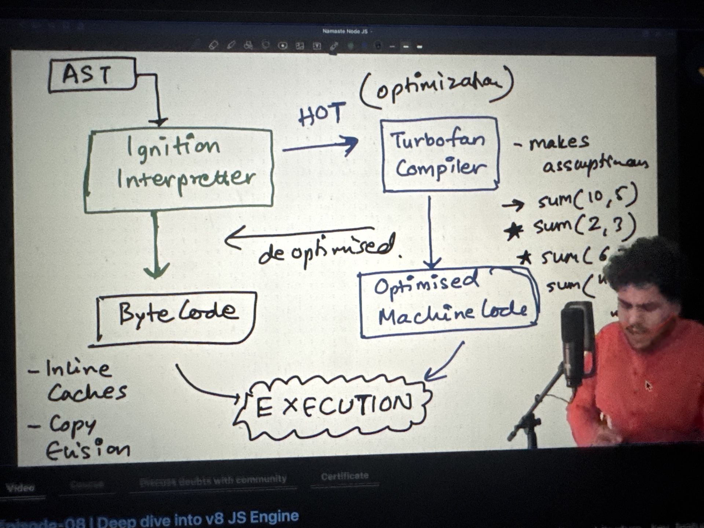

## NodeJS

- In simple words we can say as ( V8 Engine + Super Powers to handle async calls and other cool stuff)
- Note: All the async call's will be executed only after the main thread completes the execution of Global Execution Context
  - For example: If you setTimeout(()=>{console.log("Execute ASAP"}, 0) will not immediately execute the code after this is offloaded to libuv, the libuv 
    calls will wait until the GEC completes execution and only after that all the callback functions are loaded back to call stack of v8 JS engine.

    
### JIT (Just In Time Compiler) [A Combination of Interpreter and Compiler]
- There are basically 2 types of languages i.e., interpreted languages like python and compiled languages like java. But java script V8 engine uses both styles
i.e., it does interpretation and compilation. It's compiler is called as JIT compiler.
- V8 engine is just-in-time compiler.
    - When AST is passed to Interpreter (Ignition Interpreter from V8), the job of this interpreter is to convert the AST to machine code / Byte Code then the code is executed.
    - V8 uses Turbo Fan Compiler behind the scenes during interpreter. The hot code is transferred to the compiler code, and compilation helps in optimizing the code and helps in execution much faster.
        - Sometimes there is a de-optimisation happens i.e., compiler re-transfers the hot code back to interpreter.

    

### Super Power 1 (libuv) : Asynchronous I/O Made Simple.
  - One such super hero is **libuv** which helps JS to perform asynchronous calls.
    - It offloads all the async tasks which requires some intervention/interaction with OS to libuv.
    - It helps JS to perform asynchronous calls.
    

### References

- [AST Explorer]( https://astexplorer.net/) To visually explore the AST from our JS code